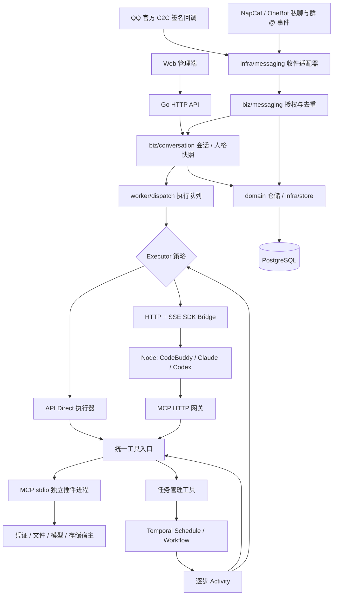

# 架构与恢复语义

## 目录与装配边界

| 位置 | 责任 |
|---|---|
| `cmd/catbot` | 薄启动入口，调用 `bootstrap.Run` |
| `internal/config` | 环境配置与启动参数 |
| `internal/bootstrap` | 创建服务、注册消息适配器、注入依赖；启动与关闭 HTTP、Worker、队列及对账器 |
| `internal/domain` | 按 agent、conversation、persona、plugin、messaging、task 等模块组织实体、校验和状态规则；`repository` 封装对应业务记录的读写 |
| `internal/biz` | 会话提交执行、工具授权、人格管理、插件生命周期、任务命令、消息投递、邮件监听和系统管理等用例 |
| `internal/infra` | PostgreSQL/内存存储、凭证加密、附件、模型 HTTP 协议、SDK 桥接、MCP 插件进程、QQ/OneBot 协议和 Temporal 调度客户端 |
| `internal/transport` | 管理 HTTP/SSE、内部 MCP 和插件宿主 HTTP 的认证、编解码与用例调用 |
| `internal/worker` | 即时对话队列、周期对账、Temporal Workflow/Activity 注册和运行边界 |

`bootstrap.App` 只负责组合依赖。HTTP 管理端显式接收各业务服务；内部 MCP 和插件宿主使用小接口注入，均不依赖整个 App。即时对话、后台 Agent 步骤和插件宿主工具分别通过相应业务用例进入同一套授权、结果与通知流程。

Node SDK 服务位于 `runtime/src`：`contracts.ts` 定义请求/事件，`registry.ts` 注册提供商，`execution.ts` 管理执行上下文，`providers/` 实现 CodeBuddy、Claude、Codex，`shared/` 复用提示词、权限、环境和事件处理。HTTP/SSE 入口不包含厂商分支。

## 对话与执行

`internal/domain/agent` 的 `Executor.Run(ctx, Request, Emit)` 是本项目的执行接口；同包 `Direct` 实现工具循环，`internal/infra/agent/modelapi` 实现模型协议请求，`internal/infra/agent/sdkbridge.Bridge` 实现 SDK HTTP/SSE 桥接。厂商 SDK 类型只出现在 Node 服务。

`Run` 保存模型配置、人格版本、插件版本引用、时间、状态、结果、用量及原生会话标识。`Event` 具有单调序号，Web SSE 支持 `Last-Event-ID` 重放；数据库是历史事实来源。

同一会话在 Go 进程内排队，并用数据库会话锁保护历史读改写；不同会话最多 8 个即时运行。后台任务不进入即时聊天调度队列。部署默认单个 Go API/Worker 实例，不能直接扩容多个实例而不补分布式队列领取与实例租约。

PostgreSQL 使用 JSONB 记录表和独立事件表，查询使用参数绑定。业务连接池与锁连接池分开；锁竞争通过 `pg_try_advisory_lock` 等待，等待者释放连接，避免阻塞锁耗尽业务连接池。

人格快照随提交固定。策略配置、人格或插件集合改变时，原生会话映射指纹改变，新 SDK 上下文由公共历史创建。SDK 失败会清除自动恢复资格；失败运行自己的原生 ID 仍保留供检查。

## 工具与插件

`biz/toolcall` 统一处理运行工具授权与内置任务工具；`biz/plugin.Manager` 管理注册、配置、快照、权限与调用记录。`domain/plugin` 保存 Manifest/Schema/授权及快照键规则，`infra/plugin` 负责冻结包、启动与复用 MCP stdio 进程、工具调用和日志读取。

- API：协议响应 → 参数聚合 → JSON Schema 校验 → 权限检查 → MCP 调用 → 结果回传 → 下一轮。
- SDK：官方循环调用 MCP HTTP 网关；网关验证运行专属 token，重新检查本轮工具范围。
- 能力不匹配时显示错误，不换后端。
- 插件声明权限，管理员授予权限，人格只能进一步缩小范围。
- 每个包的内容摘要和版本被固定；相同版本下修改包内容会被拒绝。冻结包在持久化目录保留，运行与任务引用快照。
- 插件调用按插件 ID 串行，避免多版本进程并发更新同一邮箱游标。不同插件仍能并行。
- `operationId` 贯穿调用和 MCP `_meta`；结果落库后可去重。非重试安全工具在此前执行结果不明时拒绝重跑。

## Temporal 边界

`biz/task.Commands` 处理任务保存、控制和调度对账；`biz/task.ExecutionHost` 处理 Begin、步骤结果与 Finish，`StepRunner` 调用插件或对话服务。`infra/temporal` 负责 Schedule/Workflow 客户端操作，`worker/temporal` 保留持久化 Workflow 与 Activity 边界。

已持久化名称保持兼容：任务队列 `secretary-tasks`、Workflow `TaskWorkflow`、Activities `Begin` / `ExecuteStep` / `Finish`；Workflow ID、操作 ID、JSON 字段、数据库记录种类和插件快照键不因包路径改变。

周期任务使用 Schedule，默认 `SKIP`；一次性任务使用 `StartDelay`。步骤可配置 `delaySec`，由 Workflow `NewTimer` 持久化等待。

每个步骤是单独 Activity。Workflow 只携带任务快照、凭证引用和结果引用；完整步骤结果保存在业务库，避免大邮件、视频产物塞入 Temporal 历史。

SDK 整轮请求是一个 Activity 边界，不承诺恢复其内部每次模型调用。Worker 中断后，已完成 Activity 由 Temporal 历史重放；未确认的 SDK 运行以 `interrupted` 停止。重试安全的插件步骤可以重新执行；写入工具应使用操作 ID 或幂等写法。

任务修改、取消与 Begin 状态检查使用同一任务锁。手动与定时入口在 Begin 检查运行占用，避免同一任务重叠。暂停影响后续调度；已经开始的固定快照继续执行。取消会请求停止正在执行的工作。

每次新任务执行在 Begin 读取当前模型配置、人格、依赖插件的版本与授权，然后固定快照。任务保存时确定依赖插件集合；若要让已有 Agent 任务使用后来新增的插件，需要编辑并保存该任务。

调度意图先落 PostgreSQL，外部操作完成后清除；进程启动及周期对账恢复未完成意图。一次性和手动运行使用稳定 Workflow ID 与 `REJECT_DUPLICATE`，避免成功完成后因重试再次启动。

## 状态与副作用

运行可能为 `queued / running / completed / failed / cancelled / interrupted`；任务还有 `provisioning / active / paused / error / skipped`。通知失败独立记录，任务执行可标记 `notification_failed`。

消息发送只依赖 `domain/messaging.Sender.Send(ctx, OutboundMessage)`，连接检查使用独立的 `StatusChecker`。`internal/infra/messaging/qqofficial` 使用 Ed25519 验签，`internal/infra/messaging/onebot` 使用 HTTP HMAC-SHA1 验签及 Bearer API 认证。协议处理通过构造函数接收配置、凭证缓存接口与接收回调，不依赖整个 App 或会话用例。官方 token 缓存实现单独封装凭证读写。

适配器将平台事件转换成 `InboundMessage`，统一进入 `biz/messaging.Service.HandleIncoming`。框架负责绑定授权、去重、会话和执行队列。即时回复与 Temporal 通知通过 `NotifyRecord` 记录通知，再交给 `DeliverNotification` 处理发送意图、稳定操作 ID 和投递结果；`SendMessage` 是不带回复引用的便捷入口。官方回复引用从旧有收件记录转换为通用 `ReplyReference`，由适配器映射到平台字段。

`internal/bootstrap/channels.go` 是实现选择点。注册项把路由键、发送器、可选状态检查、接收 HTTP handler、绑定策略与管理页信息组合起来；注册在 Worker 和 HTTP 启动前完成。更换实现保留 `official/onebot` 路由键即可复用已有会话与任务，不做运行时热替换。详细示例见 [消息适配器](message-adapters.md)。

去重键包括路由、登录账号、群（若有）、联系人和平台消息 ID。会话保存 `channelProvider / channelAccount / channelRoom / recipient`，发送时按会话选择注册的 Sender，未知路由直接失败，不回退。升级前缺少 provider 的会话仍按官方渠道发送；新的官方会话按 AppID 隔离。框架在发送前检查联系人绑定；OneBot 适配器另行核对当前登录账号，账号变化时阻止旧会话通知。

OneBot 接受绑定联系人的私聊，以及 `allowedGroupIds` 中明确 @ 当前机器人的群消息；忽略未授权群、未 @、自发消息和超过十分钟的事件。群会话按路由、账号、群与发言人隔离，使用单独配置的群人格与明确工具清单。官方 QQ 适配器仍只接入私聊。现有 OneBot 首次绑定必须校验接入服务当前登录账号。自研实现可选择不提供状态检查，管理端明确显示状态未验证。停用影响新接收和发送，不撤回已经提交的 Agent 运行。更换默认人格、模型配置只影响新建会话，已有会话可在对话页修改。

调用发送接口前持久化 `uncertain`；拿到明确成功回执后更新 `sent`。无法确认远端接收时保留 `uncertain`，不进行盲目网络重试。平台明确拒绝的发送记录为 `failed`。这是应用层防重复发送，不是对外部平台的 exactly-once 保证。NapCat HTTP 上报不提供离线消息持久化保证，后端不可用期间的事件可能丢失。

AES-GCM 加密凭证，认证 cookie 为 HttpOnly + SameSite Strict，并校验变更请求 Origin。登录失败设有速率限制。内部 SDK 和插件通道不经 Nginx 对外暴露。

品牌名称为 catbot；`secretary_session` cookie、默认人格 ID、SDK MCP 标识及内部请求头等已有协议标识仍保留，避免使现有登录、原生会话与插件失效。
