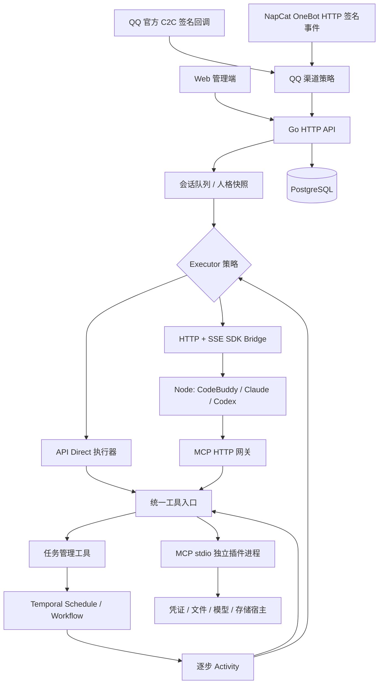

# 架构与恢复语义

## 对话与执行

`agent.Executor.Run(ctx, Request, Emit)` 是本项目的执行接口。`Direct` 和 `Bridge` 实现两类策略。厂商 SDK 类型只出现在 Node 服务。

`Run` 保存模型配置、人格版本、插件版本引用、时间、状态、结果、用量及原生会话标识。`Event` 具有单调序号，Web SSE 支持 `Last-Event-ID` 重放；数据库是历史事实来源。

同一会话在 Go 进程内排队，并用数据库会话锁保护历史读改写；不同会话最多 8 个即时运行。后台任务不进入即时聊天调度队列。部署默认单个 Go API/Worker 实例，不能直接扩容多个实例而不补分布式队列领取与实例租约。

PostgreSQL 使用 JSONB 记录表和独立事件表，查询使用参数绑定。业务连接池与锁连接池分开；锁竞争通过 `pg_try_advisory_lock` 等待，等待者释放连接，避免阻塞锁耗尽业务连接池。

人格快照随提交固定。策略配置、人格或插件集合改变时，原生会话映射指纹改变，新 SDK 上下文由公共历史创建。SDK 失败会清除自动恢复资格；失败运行自己的原生 ID 仍保留供检查。

## 工具与插件

- API：协议响应 → 参数聚合 → JSON Schema 校验 → 权限检查 → MCP 调用 → 结果回传 → 下一轮。
- SDK：官方循环调用 MCP HTTP 网关；网关验证运行专属 token，重新检查本轮工具范围。
- 能力不匹配时显示错误，不换后端。
- 插件声明权限，管理员授予权限，人格只能进一步缩小范围。
- 每个包的内容摘要和版本被固定；相同版本下修改包内容会被拒绝。冻结包在持久化目录保留，运行与任务引用快照。
- 插件调用按插件 ID 串行，避免多版本进程并发更新同一邮箱游标。不同插件仍能并行。
- `operationId` 贯穿调用和 MCP `_meta`；结果落库后可去重。非重试安全工具在此前执行结果不明时拒绝重跑。

## Temporal 边界

周期任务使用 Schedule，默认 `SKIP`；一次性任务使用 `StartDelay`。步骤可配置 `delaySec`，由 Workflow `NewTimer` 持久化等待。

每个步骤是单独 Activity。Workflow 只携带任务快照、凭证引用和结果引用；完整步骤结果保存在业务库，避免大邮件、视频产物塞入 Temporal 历史。

SDK 整轮请求是一个 Activity 边界，不承诺恢复其内部每次模型调用。Worker 中断后，已完成 Activity 由 Temporal 历史重放；未确认的 SDK 运行以 `interrupted` 停止。重试安全的插件步骤可以重新执行；写入工具应使用操作 ID 或幂等写法。

任务修改、取消与 Begin 状态检查使用同一任务锁。手动与定时入口在 Begin 检查运行占用，避免同一任务重叠。暂停影响后续调度；已经开始的固定快照继续执行。取消会请求停止正在执行的工作。

每次新任务执行在 Begin 读取当前模型配置、人格、依赖插件的版本与授权，然后固定快照。任务保存时确定依赖插件集合；若要让已有 Agent 任务使用后来新增的插件，需要编辑并保存该任务。

调度意图先落 PostgreSQL，外部操作完成后清除；进程启动及周期对账恢复未完成意图。一次性和手动运行使用稳定 Workflow ID 与 `REJECT_DUPLICATE`，避免成功完成后因重试再次启动。

## 状态与副作用

运行可能为 `queued / running / completed / failed / cancelled / interrupted`；任务还有 `provisioning / active / paused / error / skipped`。通知失败独立记录，任务执行可标记 `notification_failed`。

消息发送只依赖 `message.Sender.Send(ctx, OutboundMessage)`，连接检查使用独立的 `StatusChecker`。`internal/transport/qqofficial` 使用 Ed25519 验签，`internal/transport/onebot` 使用 HTTP HMAC-SHA1 验签及 Bearer API 认证。两者不引用 `service.App`、业务数据库或会话类型；通过构造函数接收配置、凭证缓存与接收回调。

适配器将平台事件转换成 `InboundMessage`，统一进入 `App.HandleIncoming`。框架负责绑定授权、去重、会话和执行队列。`App.SendMessage` 负责发送意图、稳定操作 ID 和结果记录，即时回复与 Temporal 通知共用该入口。官方回复引用从旧有收件记录转换为通用 `ReplyReference`，由适配器映射到平台字段。

`cmd/catbot/channels.go` 是实现选择点。注册项把路由键、发送器、可选状态检查、接收 HTTP handler、绑定策略与管理页信息组合起来；注册在 Worker 和 HTTP 启动前完成。更换实现保留 `official/onebot` 路由键即可复用已有会话与任务，不做运行时热替换。详细示例见 [消息适配器](message-adapters.md)。

去重键包括路由、登录账号、联系人和平台消息 ID。会话保存 `channelProvider / channelAccount / recipient`，发送时按会话选择注册的 Sender，未知路由直接失败，不回退。升级前缺少 provider 的会话仍按官方渠道发送；新的官方会话按 AppID 隔离。框架在发送前检查联系人绑定；OneBot 适配器另行核对当前登录账号，账号变化时阻止旧会话通知。

OneBot 只接受绑定用户的私聊消息，忽略群消息、自发消息与超过十分钟的事件。现有 OneBot 首次绑定必须校验接入服务当前登录账号。自研实现可选择不提供状态检查，管理端明确显示状态未验证。停用影响新接收和发送，不撤回已经提交的 Agent 运行。更换默认人格、模型配置只影响新建会话，已有会话可在对话页修改。

调用发送接口前持久化 `uncertain`；拿到明确成功回执后更新 `sent`。无法确认远端接收时保留 `uncertain`，不进行盲目网络重试。平台明确拒绝的发送记录为 `failed`。这是应用层防重复发送，不是对外部平台的 exactly-once 保证。NapCat HTTP 上报不提供离线消息持久化保证，后端不可用期间的事件可能丢失。

AES-GCM 加密凭证，认证 cookie 为 HttpOnly + SameSite Strict，并校验变更请求 Origin。登录失败设有速率限制。内部 SDK 和插件通道不经 Nginx 对外暴露。
